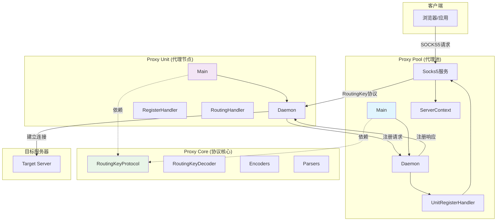
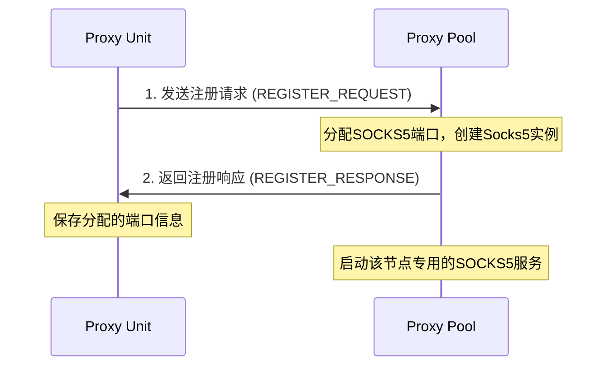
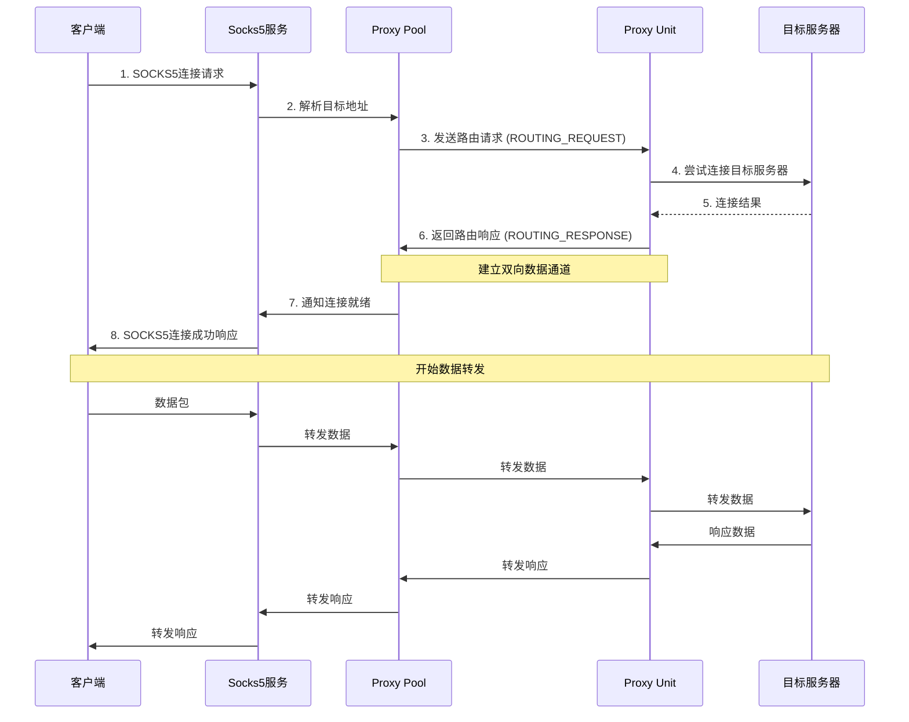

# Routing Key 代理系统

## 项目概述

Routing Key 是一个基于 Netty 的分布式代理系统，通过自定义的 RoutingKey 协议实现代理节点间的通信和流量转发。系统由三个核心模块组成：`proxy-core`（协议核心）、`proxy-pool`（代理池）和 `proxy-unit`（代理节点），支持动态代理注册和 SOCKS5 代理功能。

## 系统架构图



## 模块详细说明

### 1. proxy-core (协议核心模块)

**职责**: 定义 RoutingKey 协议规范，提供编解码器和通用处理器

**主要组件**:
- `RoutingKeyProtocol`: 协议定义类，包含魔数和消息类型枚举
- `RoutingKeyDecoder`: 协议解码器，解析接收到的字节流
- `Parser 接口`: 报文解析器接口
  - `RegisterRequestParser`: 注册请求解析器
  - `RegisterResponseParser`: 注册响应解析器  
  - `RoutingParser`: 路由请求/响应解析器
- `Encoder`: 各类型报文编码器
- `P2PInboundHandler`: 点对点通信处理器
- `ExceptionHandler`: 异常处理器
- `NetUtil`: 网络工具类

### 2. proxy-pool (代理池模块)

**职责**: 作为代理服务器，管理多个代理节点，为客户端提供 SOCKS5 代理服务

**核心流程**:
1. 启动 Daemon 监听代理节点注册
2. 接收 proxy-unit 注册请求
3. 为每个注册的 proxy-unit 分配独立的 SOCKS5 端口
4. 客户端通过 SOCKS5 连接，流量通过 RoutingKey 协议转发到对应的 proxy-unit

**主要组件**:
- `Main`: 程序入口，启动 ServerContext
- `Daemon`: 守护进程，监听代理节点注册
- `UnitRegisterInbounderHandler`: 处理节点注册请求
- `Socks5`: SOCKS5 代理服务器实现
- `SplitFlowInboundHandler`: 流量分发处理器
- `RoutingResponseInboundHandler`: 路由响应处理器
- `ConnectionStatisticsHandler`: 连接统计处理器
- `ServerContext`: 服务器上下文，管理所有代理实例

**配置文件** (`routing-key.yml`):
```yaml
proxy-port: 8080        # 代理池监听端口
servlet-port: 8085      # Web管理端口
servlet-path: available # Web管理路径
```

### 3. proxy-unit (代理节点模块)

**职责**: 作为代理客户端，连接到 proxy-pool 注册自己，并执行实际的流量转发

**核心流程**:
1. 连接到 proxy-pool 并发送注册请求
2. 接收 proxy-pool 分配的 SOCKS5 端口信息
3. 等待接收路由请求，建立到目标服务器的连接
4. 建立双向数据通道，进行流量转发

**主要组件**:
- `Main`: 程序入口，启动 Daemon
- `Daemon`: 守护进程，管理与 proxy-pool 的连接
- `RegisterInboundHandler`: 处理注册响应
- `RoutingInboundHandler`: 处理路由请求，建立目标连接

**配置文件** (`routing-key.yml`):
```yaml
proxy-ip: "127.0.0.1"      # 代理池IP地址
proxy-port: 8080           # 代理池端口
unit-hostname: "3-star-phone"  # 节点主机名
```

## RoutingKey 协议详解

### 协议格式

RoutingKey 协议采用二进制格式，具有以下基本结构：

```
+---------------------------------------------------------------+
| 魔数(1byte) | 消息类型(1byte) | 数据体(可变长字节)             |
+---------------------------------------------------------------+
```

### 协议常量

- **魔数 (Magic Number)**: `0x44` - 用于识别 RoutingKey 协议报文
- **消息类型**: 定义了四种消息类型

### 消息类型详解

#### 1. 注册请求 (REGISTER_REQUEST: 0x00)

**用途**: proxy-unit 向 proxy-pool 发送注册请求

**报文格式**: 
```
+----------+----------+
| 魔数(1B) | 类型(1B) |
+----------+----------+
| 0x44     | 0x00     |
+----------+----------+
```

**数据体**: 无数据体，仅包含协议头

#### 2. 注册响应 (REGISTER_RESPONSE: 0x01)

**用途**: proxy-pool 向 proxy-unit 返回注册结果

**报文格式**:
```
+----------+----------+----------+------------+
| 魔数(1B) | 类型(1B) | 状态(1B) | 端口(4B)   |
+----------+----------+----------+------------+
| 0x44     | 0x01     | success  | socksPort  |
+----------+----------+----------+------------+
```

**字段说明**:
- `状态 (1字节)`: 
  - `0x00`: 注册失败
  - `0x01`: 注册成功
- `端口 (4字节)`: 分配给该节点的 SOCKS5 代理端口号（仅成功时有效）

#### 3. 路由请求 (ROUTING_REQUEST: 0x02)

**用途**: proxy-pool 向 proxy-unit 发送连接目标服务器的请求

**报文格式**:
```
+----------+----------+-------------+----------+----------+-------------+----------------+
| 魔数(1B) | 类型(1B) | IP长度(4B)  | IP地址   | 端口(4B) | 成功标识(1B)| 标识值(36B)    |
+----------+----------+-------------+----------+----------+-------------+----------------+
| 0x44     | 0x02     | ipLength    | destIP   | destPort | success     | identifyValue  |
+----------+----------+-------------+----------+----------+-------------+----------------+
```

#### 4. 路由响应 (ROUTING_RESPONSE: 0x03)

**用途**: proxy-unit 向 proxy-pool 返回连接结果

**报文格式**: 与路由请求相同

**字段说明**:
- `IP长度 (4字节)`: 目标IP地址的字节长度
- `IP地址 (可变长)`: 目标服务器IP地址字符串
- `端口 (4字节)`: 目标服务器端口号
- `成功标识 (1字节)`:
  - `0x00`: 连接失败
  - `0x01`: 连接成功
- `标识值 (36字节)`: UUID字符串，用于唯一标识本次路由操作

## 系统工作流程

### 1. 节点注册流程



### 2. 代理请求流程



## 技术特性

### 协议特性
- **二进制协议**: 高效的数据传输，低开销
- **状态机解析**: 支持不同类型报文的统一解析框架
- **唯一标识**: 使用UUID标识每次路由操作，支持并发处理

### 系统特性
- **分布式架构**: 支持多个代理节点的统一管理
- **动态注册**: 代理节点可动态加入和退出
- **连接复用**: 每个代理节点分配独立的SOCKS5端口
- **异常处理**: 完善的异常处理和连接清理机制

### 网络特性
- **基于Netty**: 高性能的异步网络通信
- **SOCKS5支持**: 兼容标准SOCKS5协议
- **双向代理**: 支持请求和响应的双向转发
- **连接池管理**: 高效的连接生命周期管理

## 快速开始

### 环境要求
- JDK 8+
- Maven 3.6+

### 编译和打包
```bash
# 编译整个项目
mvn clean compile

# 打包项目（会生成可执行jar）
mvn clean package
```

### 部署和启动

#### 1. 启动代理池服务器
```bash
# 方式1：使用 Maven 直接运行
cd proxy-pool
mvn exec:java

# 方式2：使用打包后的 jar
cd proxy-pool
java -jar target/proxy-pool-1.0.0.jar
```

#### 2. 启动代理节点
```bash
# 方式1：使用 Maven 直接运行
cd proxy-unit
mvn exec:java

# 方式2：使用打包后的 jar  
cd proxy-unit
java -jar target/proxy-unit-1.0.0.jar
```

#### 3. 验证部署
访问管理界面检查代理状态：
```bash
curl http://localhost:8085/available
```
返回示例：`[9001,9002,9003]` 表示当前可用的SOCKS5代理端口

#### 4. 配置客户端
- **SOCKS5代理地址**: proxy-pool服务器IP（默认：localhost）
- **SOCKS5代理端口**: 从管理接口获取的可用端口之一

## 监控与管理

系统提供HTTP管理接口，可通过以下地址访问：
- 管理地址: `http://[proxy-pool-ip]:8085/available`
- 功能: 查看当前可用的代理连接状态

## 依赖关系

```
routing-key (父项目)
├── 公共依赖: netty-all, slf4j-api, logback-classic, lombok
├── proxy-core (协议核心)
│   └── 额外依赖: snakeyaml
├── proxy-pool (代理池)
│   └── 额外依赖: proxy-core, tomcat-embed-core, jul-to-slf4j, fastjson2
└── proxy-unit (代理节点)
    └── 额外依赖: proxy-core
```

## 配置说明

### proxy-pool 配置 (proxy-pool/src/main/resources/routing-key.yml)
```yaml
proxy-port: 8080        # 代理池监听端口（用于代理节点注册）
servlet-port: 8085      # Web管理接口端口
servlet-path: available # Web管理接口路径
```

### proxy-unit 配置 (proxy-unit/src/main/resources/routing-key.yml)
```yaml
proxy-ip: "127.0.0.1"           # 代理池服务器IP地址
proxy-port: 8080                # 代理池服务器端口
unit-hostname: "my-proxy-unit"  # 代理节点主机名标识
```

## 故障排除

### 常见问题

**Q: 代理节点无法连接到代理池？**
A: 检查以下项目：
- 确保 proxy-pool 已启动且监听在配置的端口上
- 检查 proxy-unit 配置中的 proxy-ip 和 proxy-port 是否正确
- 确认网络连通性和防火墙设置

**Q: SOCKS5连接失败？**
A: 可能的原因：
- 代理节点未正确注册到代理池
- 目标服务器不可达
- 客户端配置的SOCKS5端口错误

**Q: 管理接口返回空数组？**
A: 表示当前没有可用的代理节点，检查：
- 是否有代理节点成功连接到代理池
- 查看代理池和代理节点的日志

### 日志配置
系统使用 logback 记录日志，可通过以下方式调整日志级别：
- 在 resources 目录下添加 `logback.xml` 配置文件
- 通过 JVM 参数：`-Dlogging.level.cn.pug=DEBUG`

## 性能调优

### JVM 参数建议
```bash
# 代理池服务器
java -Xmx2g -Xms1g -XX:+UseG1GC -jar proxy-pool-1.0.0.jar

# 代理节点
java -Xmx512m -Xms256m -XX:+UseG1GC -jar proxy-unit-1.0.0.jar
```

### 网络优化
- 适当调整系统的文件描述符限制
- 优化TCP内核参数
- 监控网络连接数和带宽使用情况

## 安全建议

1. **网络安全**: 在生产环境中，建议：
   - 使用VPN或专用网络连接代理节点
   - 限制管理接口的访问来源
   - 定期更新依赖库版本

2. **访问控制**: 
   - 设置适当的防火墙规则
   - 使用非标准端口增加安全性
   - 考虑添加认证机制

3. **监控和审计**:
   - 监控异常连接和流量模式
   - 记录关键操作日志
   - 设置资源使用告警
